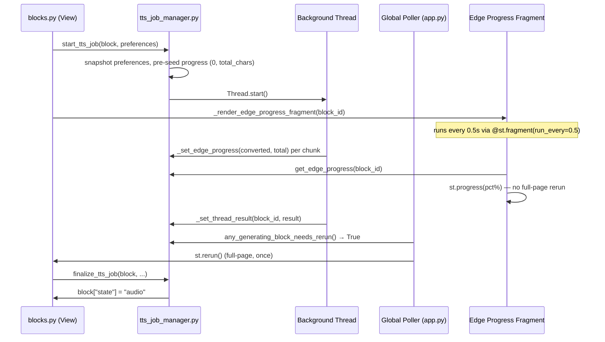
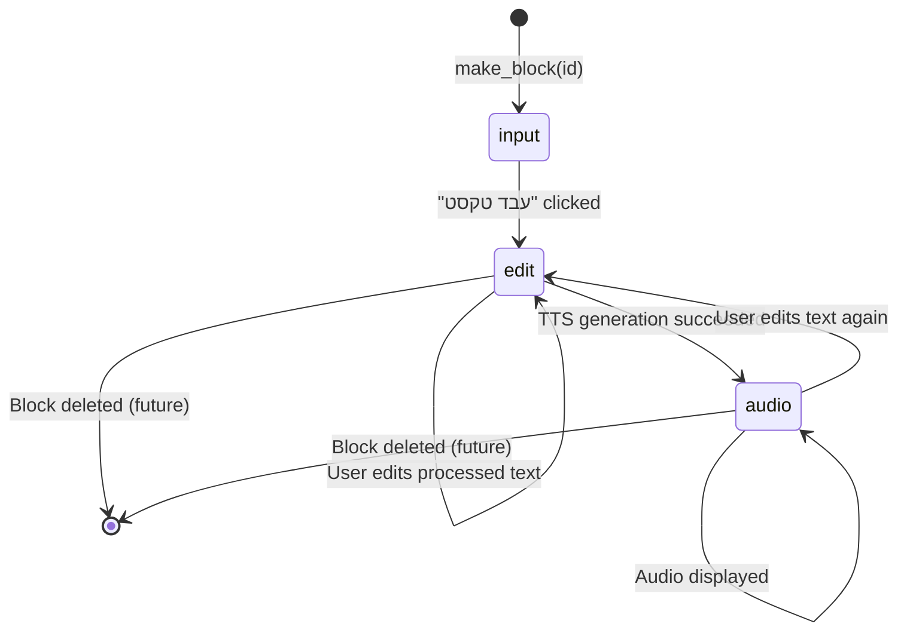

# Frontend & UI Team Documentation

This document provides focused context for the Frontend & UI team working on the Gemini Hebrew TTS project.

## Area of Responsibility
- Streamlit application entry point (`app.py`)
- UI components (`ui/` directory)
- TTS job lifecycle management (`ui/tts_job_manager.py`)
- Session state management
- CSS/RTL styling

## Key Components

### 1. Main Application (`app.py`)

**Purpose**: Streamlit application entry point and orchestrator.

**Key Responsibilities**:
- Application initialization
- Logging setup
- Session state initialization
- Rate limiter cleanup (before render loop)
- Component coordination
- CSS injection

**Structure**: Minimal entry point (~80 lines) that delegates to UI components.

**Key Data Structures**:
```python
# Block structure — created via make_block(block_id) factory
{
    "id": int,
    "state": "input" | "edit" | "audio",
    "original": str,
    "processed": str,
    "audio_path": str | None,
    "voice": str | None,
    "engine": str | None,   # "gemini" | "edge"
    "name": str | None
}

# API requests tracking
st.session_state.api_requests: List[float]  # Timestamps

# Notebook management
st.session_state.notebook_name: str

# Preferences (cached in session_state to survive reruns)
st.session_state.preferences: dict

# Generation flags (per block)
st.session_state[f"block_{id}_generating"]: bool
st.session_state[f"block_{id}_preferences"]: dict  # snapshot at click time
st.session_state[f"block_{id}_error"]: str | None
```

**Main Flow**:
1. Initialize logging
2. Configure Streamlit page
3. Inject custom CSS (`inject_custom_css()`)
4. Initialize session state (`blocks`, `api_requests`, `notebook_name`)
5. Clean stale API request timestamps (`rate_limiter.clean_old_requests`)
6. Render editable notebook title
7. Render sidebar (get preferences)
8. Render text blocks
9. Render add block button
10. Register global generation poller fragment

---

### 2. TTS Job Manager (`ui/tts_job_manager.py`)

**Purpose**: Owns all background TTS thread state and job lifecycle logic.
`blocks.py` (View) has zero threading knowledge; it only calls functions from this module.

**Public API**:
```python
start_tts_job(block: dict, preferences: dict) -> bool
finalize_tts_job(block: dict, block_index: int, rate_limiter: RateLimiter) -> None
any_generating_block_needs_rerun() -> bool
make_block(block_id: int) -> dict
get_edge_progress(block_id: int) -> tuple[int, int]  # (converted_chars, total_chars)
```

**`start_tts_job`**:
- Snapshots preferences into `session_state` so sidebar changes mid-run have no effect
- Pre-seeds `_EDGE_PROGRESS` with `(0, len(processed_text))` so a 0 % bar renders immediately
- Starts a `daemon=True` background thread
- Returns `False` (no-op) if a job is already running for that block

**`finalize_tts_job`**:
- Called on every full-page rerun from `render_text_block`
- Reads the thread result from `_TTS_RESULTS`, updates block state, saves processed text,
  appends a new block if the last block was converted, and clears all thread state
- Must only run on the main Streamlit thread

**`any_generating_block_needs_rerun`**:
- Returns `True` when any generating block has a result in `_TTS_RESULTS` or its thread died
- Used by `render_global_generation_poller` in `app.py` to gate full-page reruns

**`make_block(block_id)`**:
- Single source of truth for the block dict structure
- Used in `app.py` (initial state), `finalize_tts_job` (auto-append), `render_add_block_button`

**Internal thread state** (module-level, protected by `_THREAD_LOCK`):
- `_TTS_THREADS: dict[int, Thread]`
- `_TTS_RESULTS: dict[int, dict]`
- `_EDGE_PROGRESS: dict[int, tuple[int, int]]`  — `(converted_chars, total_chars)`

---

### 3. UI Components (`ui/`)

#### 3.1 Styles (`ui/styles.py`)
**Purpose**: Single source of truth for all CSS. No inline `st.markdown(<style>)` calls anywhere else.

**Function**: `inject_custom_css() -> None`

**CSS sections**:
- Global RTL layout (`.block-container`, sidebar, headings, labels)
- Sidebar checkbox RTL layout (general rules)
- `sidebar_static_lexicon` checkbox — help icon position (key-based selector, not positional)
- Textarea RTL
- Notebook title input (styled as `h1`, matched by `key="notebook_title_input"`)
- Block name inputs (single global rule using `id^="block_name_"`)
- Block container background

#### 3.2 Sidebar (`ui/sidebar.py`)
**Purpose**: Renders sidebar with settings and returns the selected preferences.

**Function**: `render_sidebar(rate_limiter: RateLimiter) -> dict`

**Returns**:
```python
{
    "tts_engine": str,            # "gemini" | "edge"
    "gemini_voice": str,
    "edge_voice": str,
    "gemini_prompt": str,
    "auto_nakdan_enabled": bool,
    "auto_numbers_enabled": bool,
    "static_lexicon_enabled": bool,
    "dynamic_llm_enabled": bool,
    "wait_time": int,             # 0 for Edge engine
}
```

**Design notes**:
- All module-level imports (no lazy imports inside the function)
- Single `save_prefs` call at the end: diffs current vs. session_state and saves only if changed
- Rate limit status is **display only** — `clean_old_requests` happens in `app.py`, not here
- Does **not** mutate `api_requests`

#### 3.3 Blocks (`ui/blocks.py`)
**Purpose**: Pure View. Renders notebook-style text blocks with input, processing controls, status, and audio output. Contains no threading or pipeline logic.

**Public functions**:
```python
render_text_block(block, block_index, preferences, rate_limiter) -> None
render_add_block_button() -> None
```

**Re-exported** (so `app.py` doesn't need to change its import):
```python
any_generating_block_needs_rerun  # from ui.tts_job_manager
```

**Render flow per block**:
1. Block name input (editable heading)
2. Original text area
3. "עבד טקסט" button → calls `run_pipeline(text, preferences)` from `utils/text_pipeline`
4. Processed text editor + char counter
5. TTS button → snapshots preferences, calls `start_tts_job`, renders status `st.info`
6. `finalize_tts_job` (applies completed thread result)
7. Generation status: `_render_edge_progress_fragment` (Edge) or `st.info` (Gemini)
8. Error display
9. Audio player + download button

**Edge progress fragment** (`_render_edge_progress_fragment`):
- Decorated `@st.fragment(run_every=0.5)`
- Fragment reruns are scoped — they never darken the full page
- Reads `get_edge_progress(block_id)` and renders `st.progress`
- Returns early (no-op) when `is_generating` is False

#### 3.4 Niqqud Helper (`ui/niqqud_helper.py`)
**Purpose**: Display-only tool for viewing Hebrew diacritics in the sidebar.

**Function**: `render_niqqud_helper() -> None`

**Features**:
- Collapsible expander in sidebar
- Letter selection dropdown + niqqud radio buttons
- Combined glyph displayed in `st.code` for manual copy-paste
- Information expander explaining each niqqud mark

#### 3.5 Lexicon Editor (`ui/lexicon_editor.py`)
**Purpose**: Interactive dialog for editing the static lexicon dictionary.

**Functions**:
- `render_lexicon_editor() -> None`: Renders expander in sidebar
- `@st.dialog edit_lexicon_dialog() -> None`: Modal dialog with editable table

**Features**:
- `st.data_editor` with dynamic rows, RTL column order
- Saves to `utils/lexicon.json` and reloads the lexicon module on save

---

## Text Processing Pipeline

The pipeline is centralized in `utils/text_pipeline.py` (not inline in `blocks.py`).

```python
from utils.text_pipeline import run_pipeline
processed = run_pipeline(block["original"], preferences)
```

Steps (always in this order):
1. Markdown cleaning (always)
2. Numbers to words (`auto_numbers_enabled`)
3. Static lexicon (`static_lexicon_enabled`)
4. Dynamic LLM (`dynamic_llm_enabled`)
5. Nakdan vocalization (`auto_nakdan_enabled`)

---

## TTS and Background Generation Flow



**Key design points**:
- The global poller calls `st.rerun()` **only when** `any_generating_block_needs_rerun()` is True (thread has a result or died) — not on every timer tick
- During generation, the page never darkens; only the progress fragment re-renders
- A full-page rerun fires exactly once on job completion for finalization

---

## State Management

### Block State Machine


---

## API & Utils Contract Requirements

### From Core Processing & Utils (`utils/`)
- `run_pipeline(text, preferences)` — full 5-step text processing pipeline
- `RateLimiter` class instance handling API quotas
- `save_processed_text()` — called from `finalize_tts_job` in `tts_job_manager`
- `count_characters()` / `get_char_count_message()` — character count display in blocks

### From API Services (`api/`)
- `generate_tts_audio()` — Gemini TTS, called from `tts_job_manager._generate_audio_thread`
- `generate_edge_tts_audio()` — Edge TTS with progress callback, same caller
- `dynamic_preprocess()` — LLM preprocessing (called inside `run_pipeline`)
- `auto_vocalize()` — Nakdan vocalization (called inside `run_pipeline`)
