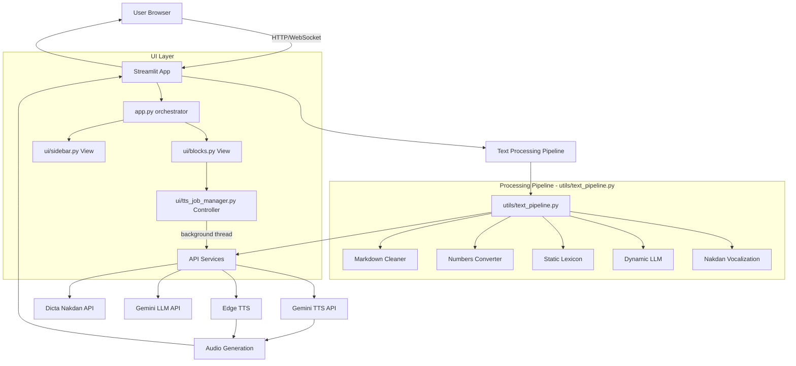

# Gemini Hebrew TTS — Technical Documentation

## Overview

**Gemini Hebrew TTS** is a web-based application for converting Hebrew text to speech using Google's Gemini AI models and Microsoft Edge TTS. The system provides a notebook-style interface where users can process multiple text blocks, apply various preprocessing steps, and generate high-quality audio output.

This project's codebase and architecture have been split into domain-specific team domains to improve modularity and provide focused context for development.

### Team Documentation Indexes
If you are looking for specific technical details, refer to the documentation for the relevant team:

1. **[Frontend & UI Team](TEAM_FRONTEND.md)** (`ui/`, `app.py`)
   *Focus: Streamlit application, session state, UI components, TTS job manager, styling.*
2. **[API Services Team](TEAM_API.md)** (`api/`)
   *Focus: Gemini TTS, Edge TTS, Gemini LLM, Dicta Nakdan integrations, and network error handling.*
3. **[Core Processing & Utils Team](TEAM_CORE.md)** (`utils/`)
   *Focus: Text preprocessing pipeline, Rate Limiter logic, and file management.*

---

## High-Level Architecture



---

## Technology Stack

### Core Technologies
| Technology | Version | Purpose |
|------------|---------|---------|
| **Python** | 3.12+ | Core programming language |
| **Streamlit** | 1.54.0 | Web UI framework |
| **Google GenAI SDK** | 1.64.0 | Gemini API integration |
| **edge-tts** | 7.2.7 | Microsoft Edge TTS (free, local) |
| **Requests** | 2.32.5 | HTTP client for external APIs |
| **Num2Words** | 0.5.14 | Number-to-text conversion |

### External APIs
1. **Google Gemini TTS API** (`gemini-2.5-flash-preview-tts`) — high-quality TTS
2. **Google Gemini LLM API** (`gemini-2.5-flash`) — dynamic text preprocessing
3. **Dicta Nakdan API** — Hebrew text vocalization (niqqud)
4. **Microsoft Edge TTS** — fast, free TTS via `edge-tts` library (offline-capable)

---

## Project Structure

```
gemini-tts-hebrew/
├── app.py                          # Main Streamlit entry point & orchestrator (UI Team)
├── requirements.txt                # Python dependencies
├── .env                            # Environment variables (API keys, gitignored)
├── .streamlit/
│   └── config.toml                 # Streamlit configuration
├── ui/                             # UI components (UI Team)
│   ├── styles.py                   # All custom CSS (single source of truth)
│   ├── sidebar.py                  # Settings sidebar (View)
│   ├── blocks.py                   # Notebook blocks (View)
│   ├── tts_job_manager.py          # TTS thread state & job lifecycle (Controller)
│   ├── niqqud_helper.py            # Hebrew diacritics helper (sidebar panel)
│   ├── lexicon_editor.py           # Static lexicon editor (sidebar dialog)
│   └── processing_step_checkbox.py # Reusable processing step checkbox component
├── api/                            # External API integrations (API Team)
│   ├── gemini_tts.py               # Google Gemini TTS
│   ├── edge_tts.py                 # Microsoft Edge TTS
│   ├── edge_chunking.py            # Text chunker for Edge TTS
│   ├── dicta_nakdan.py             # Dicta Nakdan vocalization API
│   └── llm_preprocessor.py        # Gemini LLM dynamic preprocessing
├── utils/                          # Utility modules (Core Team)
│   ├── text_pipeline.py            # Pipeline orchestrator (run_pipeline entry point)
│   ├── text_processing.py          # Legacy pipeline (not used by UI)
│   ├── markdown_cleaner.py
│   ├── numbers_converter.py
│   ├── static_lexicon.py
│   ├── rate_limiter.py
│   ├── error_handling.py
│   ├── prefs.py
│   ├── text_saver.py
│   ├── char_counter.py
│   └── logging_config.py
├── docs/                           # Team-specific documentation
│   ├── TEAM_FRONTEND.md
│   ├── TEAM_API.md
│   ├── TEAM_CORE.md
│   ├── TECHNICAL_DOCUMENTATION.md
│   ├── UX_UI_STATUS_AND_PLAN.md
│   └── LOGGING_GUIDE.md
├── notebooks/                      # Saved notebook Markdown files (auto-created)
└── audio/                          # Generated audio files (auto-created)
```

For further details regarding the interactions and specific implementations of these modules, please see the [Team Documentation Indexes](#team-documentation-indexes) above.
